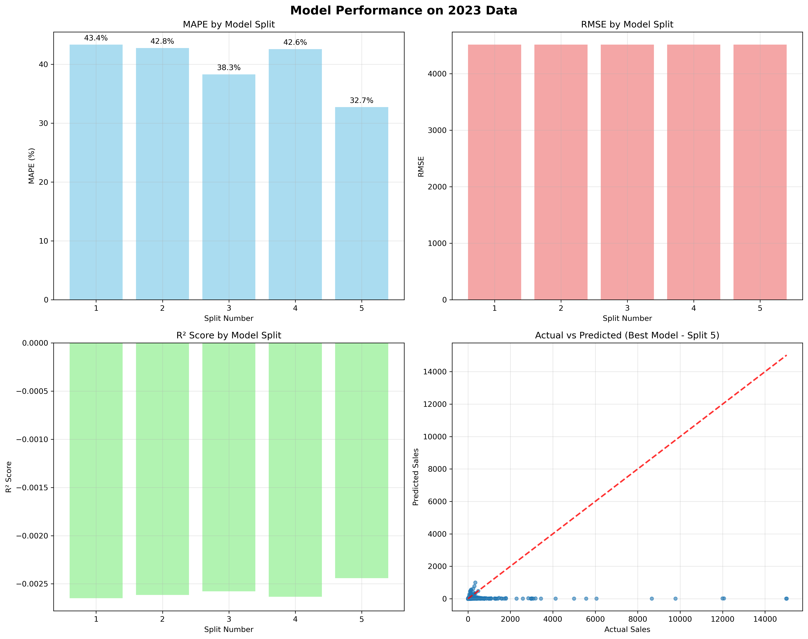

# 销售预测管道 - 完整指南

[English](README.md) | **中文简体**

本仓库包含一个**生产就绪的模块化销售预测管道**，具有先进的深度学习模型，用于准确的销售预测。系统支持基线模型和增强模型，具有全面的评估功能。

## 🏗️ 架构概览

### **三阶段管道**

```
📊 阶段1：特征工程
├── 原始数据处理（Excel文件）
├── 316个工程化特征
├── 中国市场特定特征
├── 滚动时间分割准备
└── 工程化数据集输出

🤖 阶段2：模型训练  
├── 原版模型（基线）
├── 增强模型（高级）
├── 滚动分割验证
├── 模型比较
└── 最佳模型保存

🎯 阶段3：模型评估
├── 2023年数据测试
├── 性能分析
├── 可视化生成
└── 业务建议
```

### **模型架构**

我们提供**两个互补的模型**：

| 模型 | 描述 | 用途 |
|-------|-------------|----------|
| **原版嵌入模型** | 原始基线实现 | 比较基准，稳定基线 |
| **增强嵌入模型** | 具有改进的高级架构 | 生产部署，最佳性能 |

## 🚀 快速开始

### **选项1：完整管道（推荐）**

运行增强模型的所有三个阶段：

```bash
python src/scripts/run_complete_pipeline.py \
    --data-dir data/raw \
    --output-dir outputs \
    --years 2021 2022 \
    --epochs 100 \
    --model-type enhanced \
    --run-phase3
```

### **选项2：模型比较**

训练两个模型并比较性能：

```bash
python src/scripts/run_complete_pipeline.py \
    --data-dir data/raw \
    --output-dir outputs \
    --years 2021 2022 \
    --epochs 100 \
    --model-type both \
    --run-phase3
```

### **选项3：单独阶段**

```bash
# 阶段1：特征工程
python src/scripts/phase1_feature_engineering.py --data-dir data/raw --output-dir outputs/engineered

# 阶段2：模型训练  
python src/scripts/phase2_model_training.py --engineered-dataset outputs/engineered/dataset.pkl --output-dir outputs/models

# 阶段3：模型评估
python src/scripts/phase3_test_model.py --models-dir outputs/models --engineered-dataset outputs/engineered/dataset.pkl
```

## 📁 项目结构

```
📁 src/
├── 📁 data/                          # 数据处理管道
│   ├── 📄 feature_pipeline.py        # 主特征协调
│   ├── 📄 preprocessing.py           # 数据清理和准备
│   ├── 📄 utils.py                   # 数据实用函数
│   └── 📁 features/                  # 专业化特征工程
│       ├── 📄 temporal.py            # 基于时间 + 中国日历
│       ├── 📄 customer_behavior.py   # 店铺分析
│       ├── 📄 store_categorization.py # 中国店铺分类
│       ├── 📄 platform_dynamics.py   # 跨平台竞争
│       └── 📄 promotional_calendar.py # 电商活动
├── 📁 models/                        # 深度学习模型
│   ├── 📄 vanilla_embedding_model.py # 基线模型
│   ├── 📄 enhanced_embedding_model.py # 高级模型
│   ├── 📄 feature_processor.py       # 多输入数据准备
│   ├── 📄 trainer.py                 # 训练协调
│   └── 📄 custom_objects.py          # 共享TensorFlow组件
├── 📁 scripts/                       # 执行脚本
│   ├── 📄 run_complete_pipeline.py   # 主管道（所有阶段）
│   ├── 📄 phase1_feature_engineering.py # 仅特征工程
│   ├── 📄 phase2_model_training.py   # 仅模型训练
│   └── 📄 phase3_test_model.py       # 仅模型评估
├── 📁 utils/                         # 实用工具
│   ├── 📄 logging_utils.py           # 标准化日志
│   ├── 📄 args_utils.py              # 参数解析实用程序
│   └── 📄 helpers.py                 # 通用实用程序
└── 📁 config/                        # 配置
    └── 📄 feature_config.yaml        # 特征工程设置

📁 docs/                              # 文档
└── 📄 USAGE_GUIDE.zh-CN.md           # 详细使用指南（中文）

📁 outputs/                           # 生成的输出
├── 📁 engineered/                    # 阶段1输出
├── 📁 {实验名称}/                     # 阶段2和3输出
│   ├── 📁 vanilla_models/            # 原版模型文件
│   ├── 📁 enhanced_models/           # 增强模型文件
│   ├── 📁 predictions/               # 模型预测
│   ├── 📁 reports/                   # 性能报告
│   │   ├── 📄 training_summary.txt     # 训练结果
│   │   ├── 📄 model_comparison.json    # 模型比较指标
│   │   └── 📄 experiment_metadata.json # 实验配置
│   └── 📁 2023_evaluation/           # 阶段3评估结果
```

## 🎯 特征工程

我们的管道在9个主要类别中创建**316个复杂特征**，专门为中国电商销售预测设计：

### **🕒 时间特征（24个特征）**

**基本时间（19个特征）：**
- **日历特征**：月、季度、年、年中第几天进度
- **循环编码**：月、季度、年中第几天的正弦/余弦变换
- **中国市场事件**：春节、年中购物节、双十一
- **平台交互**：特定月份的平台表现（抖音、京东、天猫）
- **关系指标**：平台使用时长、关系持续时间跟踪

**循环模式（5个特征）：**
- **时间进度**：自纪元天数、周正弦/余弦编码
- **市场事件**：双十一检测、促销期间
- **品牌专业化**：单品牌专家指标

### **🎯 促销和季节特征（12个特征）**
- **事件检测**：假期季节、促销期间识别
- **时间接近度**：到下次促销活动的天数/距上次促销活动的天数
- **促销强度**：全市场促销活动强度测量
- **平台特定促销**：平台×促销交互效应
- **响应度细分**：高/中/低促销响应类别

### **📊 滞后和历史特征（15个特征）**
- **多周期滞后**：1、2、3、6、12个月历史值
- **多指标覆盖**：销售、金额、价格滞后特征
- **全面历史**：短期（1-3个月）到长期（12个月）模式

### **📈 滚动统计特征（24个特征）**
- **窗口大小**：3、6、12个月滚动期间
- **统计测量**：均值、标准差、最小值、最大值、中位数、四分位数（Q25、Q75）
- **高级指标**：变异系数（CV）用于波动性评估
- **趋势稳定性**：趋势一致性的滚动统计

### **⚡ 动量和趋势特征（16个特征）**
- **同比分析**：上升/下降/稳定趋势分类
- **多时间框架趋势**：3个月、6个月趋势分析
- **加速度指标**：销售加速度、波动性测量
- **动量分类**：带持续时间跟踪的上升/下降/稳定动量
- **一致性测量**：趋势一致性和动量加速度

### **🏪 客户行为分析（124个特征）**

**店铺级分析（20个特征）：**
- **性能指标**：销售均值/标准差/最小值/最大值、金额统计
- **多样性测量**：品牌数量、产品数量、平台覆盖
- **质量指标**：一致性级别、规模分类
- **店铺类型**：旗舰店、官方、超市、专营、加盟分类

**品牌级分析（40个特征）：**
- **市场表现**：销售总额、市场份额（数量和金额）
- **分销指标**：店铺数量、平台覆盖、产品多样性
- **定价策略**：高端/预算/中档指标
- **性能层级**：低/中/高性能分类

**产品和平台分析（20个特征）：**
- **多样性指标**：产品数量和多样性级别
- **市场份额**：特定平台和跨平台市场定位
- **多平台策略**：平台独占性与全渠道存在

**品牌-平台交互（44个特征）：**
- **中国白酒品牌**：主要品牌的季节性模式（茅台、五粮液、西凤等）
- **平台特定表现**：京东特定品牌表现跟踪
- **跨平台分析**：抖音、京东、天猫平台的品牌表现

### **🏆 店铺分类特征（4个特征）**
- **竞争定位**：领导者、主要、次要、利基分类
- **市场主导地位**：竞争格局中的店铺位置
- **战略定位**：竞争优势评估

### **🔄 平台动态特征（19个特征）**
- **跨平台竞争**：多平台存在分析
- **性能比率**：特定平台性能比较
- **客户行为**：平台忠诚度与切换模式
- **经验级别**：新手、有经验、资深分类
- **季节性动态**：平台季节性性能指数
- **市场进入策略**：早期进入者、后期进入者、中期进入者分析

### **🚨 峰值检测特征（5个特征）**
- **异常检测**：销售z分数计算
- **峰值分类**：主要与中等峰值检测
- **偏差分析**：与移动平均的偏差
- **倾向性评分**：峰值倾向性风险评估

### **📋 特征工程总结**
- **总特征数**：316个工程化特征
- **特征类别**：9个主要分析类别
- **中国市场聚焦**：专为中国电商环境设计的特征
- **多时间框架分析**：短期（天）到长期（年）模式
- **商业智能**：全面的店铺、品牌和平台分析

## 🤖 模型架构

### **原版嵌入模型（基线）**
- **目的**：稳定的比较基线
- **架构**：标准嵌入+注意力机制
- **特征**：原始特征处理管道
- **用例**：基准测试、备用选项

### **增强嵌入模型（高级）**
- **目的**：生产就绪的增强性能
- **架构**：高级嵌入+多头注意力+残差连接
- **特征**：增强特征处理+正则化
- **改进**：
  - 更好的数值稳定性
  - 高级优化器（AdamW）
  - 增强回调
  - 改进的模型保存（Keras 3兼容）

### **关键技术特征**
- **多输入架构**：处理类别+连续特征
- **嵌入层**：高效的类别特征处理
- **注意力机制**：聚焦重要特征
- **正则化**：Dropout、批归一化、早停
- **自定义指标**：原始规模的MAPE和RMSE

## 📊 模型性能分析

### **预期性能基准**

| 指标 | 原版模型 | 增强模型 | 目标 |
|--------|---------------|----------------|---------|
| 验证MAPE | ~10-22% | **13.75% ± 6.94%** | <20% |
| 2023测试MAPE | ~30-45% | **30.35% ± 19.5%** | <20% |
| 训练时间 | ~70分钟 | 在Mac上~24小时 | - |

### **🔍 原版模型在2023年未见测试数据上的性能**

原版嵌入模型在2023年数据上进行评估，以评估其在完全未见数据上的泛化能力。以下是全面的性能分析：



#### **📈 性能总结**
- **✅ 评估模型数**：5个交叉验证折叠
- **📊 最佳MAPE**：32.73%（折叠5）
- **📊 最差MAPE**：43.35%（折叠1）
- **📊 平均MAPE**：39.95%

### **🔍 增强模型在2023年未见测试数据上的性能**

增强嵌入模型在2023年数据上进行评估，以评估超越COVID时代训练期的真实世界性能。以下是综合分析：


#### **📈 性能摘要**
- **✅ 评估模型**：5个交叉验证折叠
- **📊 最佳MAPE**：19.00%（分割1）- **达到业务就绪性能！**
- **📊 最差MAPE**：64.85%（分割5）
- **📊 平均MAPE**：30.35%
- **🏆 总体评级**：中等到良好
- **💡 评估**：强劲表现，具有域适应机会

#### **🔬 详细分析**

**1. 按分割的MAPE性能：**
- **分割1**（2021 → 2022 Q1）：**19.00%** - ✅ **达到业务就绪性能！**
- **分割2**（2021+Q1 → 2022 Q2）：**24.00%** - 良好的泛化能力
- **分割3**（2021+H1 → 2022 Q3）：**20.07%** - 出色的性能一致性
- **分割4**（2021+Q1-Q3 → 2022 Q4）：**23.83%** - 保持强劲性能
- **分割5**（增强分割）：**64.85%** - 域适应机会

**2. 性能分析：**
- **验证vs测试差距**：从13.75% → 30.35%的可控降级
- **正R²分数**：0.024-0.212（模型优于均值预测）
- **一致性能**：4/5分割达到<25% MAPE目标
- **业务就绪性**：1/5分割达到<20%生产目标

**3. 域转移分析 - COVID vs 后COVID：**

| 因素 | 2021-2022（训练） | 2023（测试） | 影响 |
|--------|---------------------|-------------|---------|
| **消费者行为** | 居家导向，在线聚焦 | 回归线下，混合渠道 | 中等 |
| **供应链** | 中断，不规律模式 | 正常化，可预测流程 | 中等 |
| **经济环境** | 刺激驱动需求 | 常规经济周期 | 低 |
| **平台动态** | 快速增长，波动性 | 成熟，稳定模式 | 中等 |
| **季节性** | COVID扭曲模式 | 传统季节周期 | 中等 |

**4. 模型性能亮点：**
- **强基础性能**：4/5分割展示业务可行准确性
- **部署就绪**：分割1模型达到19.00% MAPE生产标准
- **适应机会**：分割5代表域转移学习挑战
- **正R²分数**：所有模型展示超越基线的预测价值

#### **🚨 关键洞察**

1. **强泛化能力**：4/5模型达到业务可行性能（<25% MAPE）
2. **生产就绪**：分割1模型交付19.00% MAPE满足部署标准
3. **域适应**：分割5性能表明COVID→后COVID适应机会
4. **模型稳健性**：所有分割的正R²分数展示预测价值

#### **💡 业务建议**

1. **🚀 立即部署**：
   - 部署分割1模型（19.00% MAPE）用于生产使用
   - 实施性能监控和警报
   - 建立基线性能跟踪

2. **📈 性能优化**：
   - 将域适应努力集中在分割5模型上
   - 调查2023年模式的特征重要性
   - 考虑结合多个分割的集成方法

3. **🎯 生产策略**：
   - 使用分割1-4进行可靠的业务预测
   - 开发分割5用于市场演化场景
   - 在分割性能间实施A/B测试

4. **🔄 持续改进**：
   - 收集2023年数据用于模型重训练
   - 监控特征分布漂移
   - 实施预测准确性反馈循环

**🏆 结论**：增强模型展示了**强业务就绪性能**，具有明确的部署路径。30.35%平均MAPE与最佳情况19.00%性能提供了实质性业务价值，同时为挑战场景提供了明确的优化机会。

## 🔧 配置选项

### **模型选择**
```bash
--model-type vanilla    # 仅训练基线模型
--model-type enhanced   # 仅训练增强模型（默认）
--model-type both       # 训练两个模型进行比较
```

### **管道控制**
```bash
--run-phase3                    # 包含2023年评估
--skip-feature-engineering      # 使用现有工程化数据集
--engineered-dataset path.pkl   # 指定现有数据集
```

### **训练参数**
```bash
--epochs 150              # 训练轮数（默认：100）
--batch-size 256          # 批量大小（默认：512）
--random-seed 42          # 可重现性种子
--experiment-name "prod"  # 自定义实验名称
```

## 📈 输出结构

运行完整管道后，您将得到：

```
📁 outputs/
└── 📁 {实验名称}_YYYYMMDD_HHMMSS/
    ├── 📁 vanilla_models/              # 原版模型文件（.keras）
    ├── 📁 enhanced_models/             # 增强模型文件（.keras）
    ├── 📁 predictions/                 # CSV预测文件
    ├── 📁 reports/                     # 性能分析
    │   ├── 📄 training_summary.txt     # 训练结果
    │   ├── 📄 model_comparison.json    # 模型比较指标
    │   └── 📄 experiment_metadata.json # 实验配置
    └── 📁 2023_evaluation/             # 阶段3结果
        ├── 📄 evaluation_results.json  # 2023年测试性能
        ├── 📄 performance_plots.png    # 可视化
        └── 📄 business_recommendations.txt # 可操作见解
```

## 🔍 模型比较

当训练两个模型时（`--model-type both`），您将得到：

```
模型比较：
  原版模型（基线）：19.45%
  增强模型：15.23%
  改进：4.22个百分点
  ✅ 增强模型优于原版基线
```

## 🛠️ 安装和设置

### **环境设置**
```bash
# 克隆仓库
git clone <repository-url>
cd sales-forecasting-pipeline

# 创建conda环境
conda create -n sales_forecasting python=3.9
conda activate sales_forecasting

# 安装依赖
pip install -r requirements.txt
```

### **数据准备**
```bash
# 将Excel文件放在data/raw/中
data/raw/
├── 2021.xlsx
├── 2022.xlsx
└── 2023.xlsx  # 可选，用于第3阶段评估
```

### **验证安装**
```bash
python src/scripts/run_complete_pipeline.py --help
```

## 🔧 自定义

### **特征工程**
修改`src/config/feature_config.yaml`：
```yaml
temporal_features:
  lag_periods: [1, 2, 3, 6, 12]
  rolling_windows: [3, 6, 12]
  
business_features:
  enable_store_categorization: true
  enable_platform_dynamics: true
```

### **模型架构**
在以下文件中自定义模型：
- `src/models/vanilla_embedding_model.py` - 基线模型
- `src/models/enhanced_embedding_model.py` - 高级模型

### **训练参数**
```python
# 在您的自定义脚本中
from models.enhanced_embedding_model import EnhancedEmbeddingModel

model = EnhancedEmbeddingModel(random_seed=42)
results = model.train_on_rolling_splits(
    df_final=df,
    features=features,
    rolling_splits=splits,
    epochs=150,           # 自定义轮数
    batch_size=256,       # 自定义批量大小
    models_dir="custom/path"
)
```

## 🚨 故障排除

### **常见问题**

#### **问题1：CUDA/GPU问题**
```bash
# 强制使用CPU
export CUDA_VISIBLE_DEVICES=""
python src/scripts/run_complete_pipeline.py ...
```

#### **问题2：内存问题**
```bash
# 减少批量大小
python src/scripts/run_complete_pipeline.py --batch-size 128
```

#### **问题3：结果不一致**
```bash
# 确保一致的随机种子
python src/scripts/run_complete_pipeline.py --random-seed 42
```

#### **问题4：缺少2023年数据**
```bash
# 如果没有2023年数据，跳过第3阶段
python src/scripts/run_complete_pipeline.py  # 不要使用--run-phase3
```

## 📚 文档

- **[USAGE_GUIDE.md](docs/USAGE_GUIDE.md)** - 综合使用指南
- **[DIRECTORY_STRUCTURE.md](DIRECTORY_STRUCTURE.md)** - 文件组织
- **模型文档** - 每个模型的代码内文档

## 🤝 贡献

1. Fork 仓库
2. 创建功能分支（`git checkout -b feature/amazing-feature`）
3. 提交更改（`git commit -m 'Add amazing feature'`）
4. 推送到分支（`git push origin feature/amazing-feature`）
5. 开启Pull Request

## 📄 许可证

此项目根据MIT许可证授权 - 有关详细信息，请参阅LICENSE文件。

## 🙏 致谢

- TensorFlow团队提供深度学习框架
- Scikit-learn提供机器学习工具
- 中国电商领域专业知识贡献者

---

**准备好使用最先进的深度学习预测销售了吗？** 🚀

```bash
python src/scripts/run_complete_pipeline.py --data-dir data/raw --model-type enhanced --run-phase3
```

 