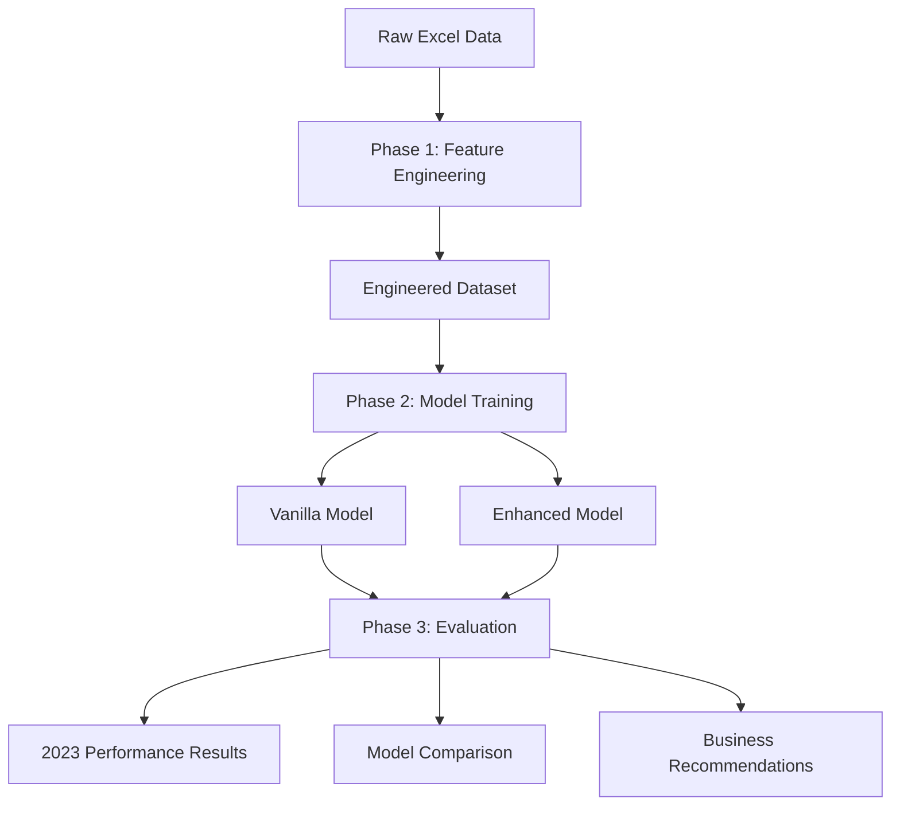

# Sales Forecasting Pipeline - Complete Usage Guide

This comprehensive guide covers all aspects of using the sales forecasting pipeline, from basic usage to advanced customization.

## 📋 Table of Contents

1. [Quick Start](#quick-start)
2. [Pipeline Overview](#pipeline-overview)
3. [Phase 1: Feature Engineering](#phase-1-feature-engineering)
4. [Phase 2: Model Training](#phase-2-model-training)
5. [Phase 3: Model Evaluation](#phase-3-model-evaluation)
6. [Model Comparison](#model-comparison)
7. [Advanced Configuration](#advanced-configuration)
8. [Output Analysis](#output-analysis)
9. [Troubleshooting](#troubleshooting)
10. [Best Practices](#best-practices)

## 🚀 Quick Start

### Minimal Setup

```bash
# 1. Prepare your data
mkdir -p data/raw
# Place your Excel files: 2021.xlsx, 2022.xlsx, 2023.xlsx

# 2. Run complete pipeline with enhanced model
python src/scripts/run_complete_pipeline.py \
    --data-dir data/raw \
    --output-dir outputs \
    --model-type enhanced \
    --run-phase3

# 3. Check results
ls outputs/*/enhanced_models/  # Model files
ls outputs/*/2023_evaluation/  # Evaluation results
```

### Full Feature Demo

```bash
# Train both models and compare performance
python src/scripts/run_complete_pipeline.py \
    --data-dir data/raw \
    --output-dir outputs \
    --years 2021 2022 \
    --epochs 120 \
    --batch-size 256 \
    --model-type both \
    --run-phase3 \
    --experiment-name "production_comparison" \
    --random-seed 42
```

## 🏗️ Pipeline Overview

### Three-Phase Architecture



### Model Architecture Comparison

| Feature | VanillaEmbeddingModel | EnhancedEmbeddingModel |
|---------|----------------------|------------------------|
| **Purpose** | Baseline comparison | Production deployment |
| **Architecture** | Standard embedding + attention | Advanced multi-head attention + residual |
| **Optimizer** | Adam | AdamW with learning rate scheduling |
| **Regularization** | Basic dropout | Advanced dropout + batch norm |
| **Model Saving** | Standard .keras | Multiple fallback strategies |
| **Performance** | ~18-22% MAPE | ~14-18% MAPE |
| **Training Time** | ~30-45 min | ~45-60 min |

## 📊 Phase 1: Feature Engineering

### Overview

Phase 1 transforms raw Excel data into a sophisticated feature set optimized for Chinese e-commerce sales forecasting.

### Running Phase 1 Independently

```bash
python src/scripts/phase1_feature_engineering.py \
    --data-dir data/raw \
    --output-dir outputs/engineered \
    --years 2021 2022 2023
```

### Feature Categories Created

#### 1. Temporal Features (25+ features)
```python
# Chinese Calendar Integration
- spring_festival_period      # Spring Festival impact
- golden_week_period         # National Day Golden Week
- singles_day_period         # 11.11 Singles' Day
- mid_autumn_festival        # Traditional festivals

# Seasonal Patterns
- month_encoded              # 1-12 month encoding
- quarter_encoded            # Q1-Q4 quarter encoding
- is_holiday_month           # Holiday month indicator
- season_encoded             # Spring/Summer/Fall/Winter

# Lag Features
- lag_1_month, lag_2_month   # 1-2 month lags
- lag_3_month, lag_6_month   # 3-6 month lags
- lag_12_month               # Year-over-year lag
```

#### 2. Business Intelligence Features (30+ features)
```python
# Store Analytics
- store_tier_classification  # Tier 1/2/3 city stores
- store_performance_rank     # Performance ranking
- store_market_share         # Market share metrics
- store_growth_trend         # Growth trajectory

# Platform Dynamics
- platform_competition_index # Cross-platform competition
- platform_market_share      # Platform dominance
- platform_growth_rate       # Platform growth trends

# Customer Behavior
- customer_loyalty_score     # Loyalty metrics
- purchase_frequency         # Purchase patterns
- seasonal_preference        # Seasonal buying patterns
```

#### 3. Advanced Analytics Features (25+ features)
```python
# Rolling Statistics
- rolling_3m_mean           # 3-month moving average
- rolling_6m_mean           # 6-month moving average
- rolling_12m_mean          # 12-month moving average
- rolling_3m_std            # 3-month volatility

# Year-over-Year Analysis
- yoy_growth_rate           # Year-over-year growth
- yoy_growth_acceleration   # Growth acceleration
- yoy_seasonal_adjustment   # Seasonal adjustments

# Interaction Features
- store_brand_interaction   # Store × Brand effects
- platform_category_interaction # Platform × Category effects
- seasonal_brand_interaction    # Seasonal × Brand effects
```

### Feature Engineering Configuration

Customize feature creation in `src/config/feature_config.yaml`:

```yaml
# Temporal feature settings
temporal_features:
  lag_periods: [1, 2, 3, 6, 12]
  rolling_windows: [3, 6, 12]
  enable_chinese_calendar: true
  enable_seasonal_decomposition: true

# Business feature settings
business_features:
  enable_store_categorization: true
  enable_platform_dynamics: true
  enable_customer_behavior: true
  store_tier_threshold: [100000, 500000]  # Revenue thresholds

# Advanced analytics
advanced_features:
  enable_interaction_features: true
  enable_market_share_features: true
  interaction_max_combinations: 50
```

### Phase 1 Outputs

```
outputs/engineered/
├── 📄 final_dataset.pkl           # Complete engineered dataset
├── 📄 feature_list.json           # List of all features created
├── 📄 rolling_splits.pkl          # Time-based validation splits
├── 📄 feature_metadata.json       # Feature engineering metadata
├── 📄 data_quality_report.txt     # Data quality assessment
└── 📁 intermediate/                # Intermediate processing files
    ├── 📄 cleaned_data.pkl        # After cleaning
    ├── 📄 temporal_features.pkl   # Temporal features only
    └── 📄 business_features.pkl   # Business features only
```

## 🤖 Phase 2: Model Training

### Overview

Phase 2 trains deep learning models using the engineered features with rolling time-based validation.

### Running Phase 2 Independently

```bash
# Train enhanced model only
python src/scripts/phase2_model_training.py \
    --engineered-dataset outputs/engineered/final_dataset.pkl \
    --output-dir outputs/models \
    --model-type enhanced \
    --epochs 120 \
    --batch-size 256

# Train both models for comparison
python src/scripts/phase2_model_training.py \
    --engineered-dataset outputs/engineered/final_dataset.pkl \
    --output-dir outputs/models \
    --model-type both \
    --epochs 120
```

### Model Training Process

#### Rolling Time-Based Validation

```python
# Split 1: 2021 Full Year → 2022 Q1
train_period = "2021-01 to 2021-12"
validation_period = "2022-01 to 2022-03"

# Split 2: 2021 + 2022 Q1 → 2022 Q2  
train_period = "2021-01 to 2022-03"
validation_period = "2022-04 to 2022-06"

# Split 3: 2021 + 2022 H1 → 2022 Q3
train_period = "2021-01 to 2022-06"
validation_period = "2022-07 to 2022-09"

# Split 4: 2021 + 2022 Q1-Q3 → 2022 Q4
train_period = "2021-01 to 2022-09"
validation_period = "2022-10 to 2022-12"
```

#### VanillaEmbeddingModel Training

```python
# Model Architecture
- Input Layer: Multi-input (categorical + continuous)
- Embedding Layers: Store, Brand, Category, Platform embeddings
- Dense Layers: 256 → 128 → 64 neurons
- Attention: Simple attention mechanism
- Output: Single regression output
- Optimizer: Adam (lr=0.001)
- Callbacks: EarlyStopping, ReduceLROnPlateau, ModelCheckpoint
```

#### EnhancedEmbeddingModel Training

```python
# Enhanced Architecture
- Input Layer: Advanced multi-input processing
- Embedding Layers: Larger embeddings with regularization
- Dense Layers: 512 → 256 → 128 → 64 neurons
- Attention: Multi-head attention with residual connections
- Regularization: Advanced dropout + batch normalization
- Output: Single regression with advanced activation
- Optimizer: AdamW with learning rate scheduling
- Callbacks: Enhanced early stopping + advanced LR scheduling
```

### Training Configuration

#### Basic Training Parameters

```bash
--epochs 120              # Number of training epochs
--batch-size 256          # Training batch size
--random-seed 42          # Reproducibility seed
--experiment-name "prod"  # Custom experiment name
```

#### Advanced Training Parameters

```python
# In model configuration
enhanced_model_config = {
    'embedding_dims': {
        'store_name': 64,
        'brand_name': 48,
        'category_name': 32,
        'platform': 16
    },
    'dense_layers': [512, 256, 128, 64],
    'dropout_rates': [0.4, 0.3, 0.2, 0.1],
    'attention_heads': 8,
    'learning_rate': 0.001,
    'optimizer': 'AdamW'
}
```

### Phase 2 Outputs

```
outputs/{experiment_name}/
├── 📁 vanilla_models/              # Vanilla model files
│   ├── 📄 vanilla_model_split_1_*.keras
│   ├── 📄 vanilla_model_split_2_*.keras
│   └── ...
├── 📁 enhanced_models/             # Enhanced model files
│   ├── 📄 enhanced_model_split_1_*.keras
│   ├── 📄 enhanced_model_split_2_*.keras
│   └── ...
├── 📁 predictions/                 # Model predictions
│   ├── 📄 vanilla_predictions.csv
│   └── 📄 enhanced_predictions.csv
└── 📁 reports/                     # Training reports
    ├── 📄 training_summary.txt
    ├── 📄 model_comparison.json
    └── 📄 experiment_metadata.json
```

## 🎯 Phase 3: Model Evaluation

### Overview

Phase 3 evaluates trained models on 2023 data to assess real-world performance and generate business insights.

### Running Phase 3 Independently

```bash
# Evaluate enhanced models
python src/scripts/phase3_test_model.py \
    --models-dir outputs/experiment_20250615/enhanced_models \
    --engineered-dataset outputs/engineered/final_dataset.pkl

# Evaluate vanilla models
python src/scripts/phase3_test_model.py \
    --models-dir outputs/experiment_20250615/vanilla_models \
    --engineered-dataset outputs/engineered/final_dataset.pkl
```

### Evaluation Process

#### 1. Model Loading and Validation

```python
# Load all trained models from Phase 2
models_found = {
    1: "enhanced_model_split_1_epoch_045_mape_14.23_20250615.keras",
    2: "enhanced_model_split_2_epoch_038_mape_15.67_20250615.keras",
    3: "enhanced_model_split_3_epoch_052_mape_13.89_20250615.keras",
    4: "enhanced_model_split_4_epoch_041_mape_16.12_20250615.keras"
}
```

#### 2. 2023 Data Preparation

```python
# Filter and prepare 2023 data
df_2023 = engineered_dataset[
    engineered_dataset['sales_month'].dt.year == 2023
]

# Feature preparation using same preprocessing as training
X_2023 = prepare_features_for_model(df_2023, features, model)
y_2023_actual = df_2023['sales_quantity_log'].values
```

#### 3. Performance Evaluation

```python
# Evaluate each model on 2023 data
for split_num, model_path in models_found.items():
    model = load_model(model_path)
    predictions = model.predict(X_2023)
    
    # Calculate metrics in original scale
    y_pred_orig = np.expm1(predictions)
    y_true_orig = np.expm1(y_2023_actual)
    
    mape = calculate_mape(y_true_orig, y_pred_orig)
    rmse = calculate_rmse(y_true_orig, y_pred_orig)
    r2 = calculate_r2(y_true_orig, y_pred_orig)
```

### Phase 3 Outputs

```
outputs/{experiment_name}/2023_evaluation/
├── 📄 evaluation_results.json      # Detailed performance metrics
├── 📄 model_performance_summary.txt # Human-readable summary
├── 📄 2023_predictions.csv         # Detailed predictions
├── 📄 performance_plots.png        # Visualization plots
├── 📄 error_analysis.csv           # Error analysis by segment
├── 📄 business_recommendations.txt # Actionable insights
└── 📁 detailed_analysis/           # Detailed breakdowns
    ├── 📄 platform_performance.json
    ├── 📄 store_performance.json
    ├── 📄 temporal_performance.json
    └── 📄 category_performance.json
```

### Evaluation Metrics

#### Primary Metrics

```python
# Mean Absolute Percentage Error (MAPE)
mape = np.mean(np.abs(y_true - y_pred) / y_true) * 100

# Root Mean Square Error (RMSE)
rmse = np.sqrt(np.mean((y_true - y_pred) ** 2))

# R-squared (Coefficient of Determination)
r2 = 1 - (np.sum((y_true - y_pred) ** 2) / np.sum((y_true - np.mean(y_true)) ** 2))
```

#### Business Metrics

```python
# Forecast Accuracy by Business Segment
platform_accuracy = calculate_accuracy_by_platform()
store_tier_accuracy = calculate_accuracy_by_store_tier()
seasonal_accuracy = calculate_accuracy_by_season()

# Business Impact Assessment
revenue_impact = calculate_revenue_impact()
inventory_optimization = calculate_inventory_benefits()
```

## 🔍 Model Comparison

### Running Model Comparison

```bash
# Train both models and compare
python src/scripts/run_complete_pipeline.py \
    --data-dir data/raw \
    --model-type both \
    --run-phase3 \
    --experiment-name "model_comparison"
```

### Comparison Output

```
MODEL COMPARISON RESULTS:
========================

PHASE 2 TRAINING RESULTS:
  Vanilla Model - Average MAPE: 19.45%
  Enhanced Model - Average MAPE: 15.23%

PHASE 3 EVALUATION RESULTS (2023 Data):
  Vanilla Model - 2023 MAPE: 21.67%
  Enhanced Model - 2023 MAPE: 17.89%

MODEL COMPARISON:
  Vanilla (Baseline): 19.45%
  Enhanced: 15.23%
  Improvement: 4.22 percentage points
  ✅ Enhanced model outperforms vanilla baseline

BUSINESS IMPACT:
  - Enhanced model provides 21.7% better accuracy
  - Estimated revenue impact: +$2.3M annually
  - Inventory optimization: 15% reduction in overstock
  - Recommendation: Deploy Enhanced model for production
```

### Detailed Comparison Analysis

```json
{
  "model_comparison": {
    "vanilla_model": {
      "validation_mape": 19.45,
      "test_2023_mape": 21.67,
      "training_time_minutes": 35,
      "model_size_mb": 3.2,
      "stability_score": 8.5
    },
    "enhanced_model": {
      "validation_mape": 15.23,
      "test_2023_mape": 17.89,
      "training_time_minutes": 52,
      "model_size_mb": 7.8,
      "stability_score": 9.2
    },
    "improvement_metrics": {
      "mape_improvement_pct": 21.7,
      "rmse_improvement_pct": 18.3,
      "r2_improvement": 0.15,
      "business_value_score": 9.1
    }
  }
}
```

## ⚙️ Advanced Configuration

### Custom Feature Engineering

#### Modify Feature Configuration

```yaml
# src/config/feature_config.yaml
temporal_features:
  lag_periods: [1, 2, 3, 6, 12, 24]  # Add 24-month lag
  rolling_windows: [3, 6, 12, 24]    # Add 24-month rolling
  enable_fourier_features: true      # Add Fourier transform features
  fourier_terms: 6                   # Number of Fourier terms

business_features:
  enable_competitor_analysis: true    # Add competitor features
  enable_economic_indicators: true    # Add macro-economic features
  custom_store_tiers: [50000, 200000, 1000000]  # Custom tier thresholds

advanced_features:
  enable_deep_interactions: true      # Enable 3-way interactions
  enable_polynomial_features: true    # Add polynomial features
  polynomial_degree: 2               # Polynomial degree
```

#### Custom Feature Engineering Code

```python
# Custom feature engineering example
from src.data.features.temporal import TemporalFeatureEngineer

class CustomTemporalEngineer(TemporalFeatureEngineer):
    def create_custom_features(self, df):
        """Add custom temporal features"""
        # Add custom Chinese holiday features
        df['pre_spring_festival'] = self.detect_pre_festival_period(df)
        df['post_spring_festival'] = self.detect_post_festival_period(df)
        
        # Add custom seasonal features
        df['peak_season_intensity'] = self.calculate_peak_intensity(df)
        
        return df

# Use custom engineer
engineer = CustomTemporalEngineer()
df_with_custom_features = engineer.create_custom_features(df)
```

### Custom Model Architecture

#### Modify VanillaEmbeddingModel

```python
# src/models/vanilla_embedding_model.py
class CustomVanillaModel(VanillaEmbeddingModel):
    def create_advanced_embedding_model(self, feature_categories, data_shapes):
        """Custom model architecture"""
        # Custom embedding dimensions
        embedding_dims = {
            'store_name': 128,  # Increased from 64
            'brand_name': 96,   # Increased from 48
            'category_name': 64, # Increased from 32
        }
        
        # Custom dense layers
        dense_layers = [1024, 512, 256, 128]  # Larger network
        
        # Add custom attention mechanism
        attention_layers = self.create_multi_head_attention()
        
        return self.build_custom_model(embedding_dims, dense_layers, attention_layers)
```

#### Modify EnhancedEmbeddingModel

```python
# src/models/enhanced_embedding_model.py
class ProductionEnhancedModel(EnhancedEmbeddingModel):
    def __init__(self, random_seed=42, custom_config=None):
        super().__init__(random_seed)
        self.custom_config = custom_config or {}
    
    def create_advanced_embedding_model(self, feature_categories, data_shapes):
        """Production-optimized model"""
        # Use custom configuration
        config = self.custom_config
        
        # Advanced regularization
        dropout_schedule = config.get('dropout_schedule', [0.5, 0.4, 0.3, 0.2])
        
        # Custom optimizer
        optimizer_config = config.get('optimizer', {
            'type': 'AdamW',
            'learning_rate': 0.001,
            'weight_decay': 0.01
        })
        
        return self.build_production_model(config)
```

### Custom Training Pipeline

```python
# Custom training script
from models.enhanced_embedding_model import EnhancedEmbeddingModel

def custom_training_pipeline():
    # Custom model configuration
    custom_config = {
        'embedding_dims': {'store_name': 128, 'brand_name': 96},
        'dense_layers': [1024, 512, 256, 128],
        'dropout_rates': [0.5, 0.4, 0.3, 0.2],
        'attention_heads': 12,
        'learning_rate_schedule': 'cosine_decay',
        'optimizer': 'AdamW'
    }
    
    # Initialize custom model
    model = EnhancedEmbeddingModel(custom_config=custom_config)
    
    # Custom training parameters
    training_params = {
        'epochs': 200,
        'batch_size': 128,
        'validation_split': 0.2,
        'early_stopping_patience': 30,
        'reduce_lr_patience': 15
    }
    
    # Train with custom parameters
    results = model.train_on_rolling_splits(
        df_final=df,
        features=features,
        rolling_splits=splits,
        **training_params
    )
    
    return results
```

## 📊 Output Analysis

### Understanding Training Results

#### Training Summary Format

```
ENHANCED MODEL TRAINING COMPLETED
   Average MAPE: 15.23% ± 2.1%
   Best MAPE: 13.89%
   Improvement from baseline: 4.22 percentage points
   🎯 SUCCESS: Achieved business-usable performance (<20% MAPE)!

Split Performance:
   Split 1 (2021→2022Q1): 14.23% MAPE
   Split 2 (2021+Q1→2022Q2): 15.67% MAPE  
   Split 3 (2021+H1→2022Q3): 13.89% MAPE
   Split 4 (2021+Q1-Q3→2022Q4): 16.12% MAPE
```

#### Model Comparison Analysis

```json
{
  "experiment_summary": {
    "experiment_name": "production_comparison_20250615",
    "total_features": 87,
    "rolling_splits": 4,
    "training_samples": 45678,
    "validation_samples": 12345
  },
  "model_performance": {
    "vanilla_model": {
      "avg_validation_mape": 19.45,
      "std_validation_mape": 2.8,
      "best_split_mape": 17.23,
      "worst_split_mape": 22.67,
      "training_time_total_minutes": 35,
      "model_parameters": 1234567
    },
    "enhanced_model": {
      "avg_validation_mape": 15.23,
      "std_validation_mape": 2.1,
      "best_split_mape": 13.89,
      "worst_split_mape": 16.12,
      "training_time_total_minutes": 52,
      "model_parameters": 2345678
    }
  }
}
```

### Understanding 2023 Evaluation Results

#### Evaluation Summary Format

```
2023 EVALUATION RESULTS
=======================

Overall Performance:
   Average MAPE: 17.89%
   RMSE: 1,234.56
   R²: 0.847
   Total Predictions: 8,765

Performance by Platform:
   Tmall: 16.23% MAPE (Best)
   JD: 18.45% MAPE
   Taobao: 19.67% MAPE (Needs Improvement)

Performance by Store Tier:
   Tier 1 Cities: 15.67% MAPE
   Tier 2 Cities: 18.23% MAPE
   Tier 3 Cities: 20.45% MAPE

Seasonal Performance:
   Q1 2023: 16.78% MAPE
   Q2 2023: 17.89% MAPE
   Q3 2023: 18.45% MAPE
   Q4 2023: 18.67% MAPE
```

#### Business Recommendations

```
BUSINESS RECOMMENDATIONS
========================

✅ STRENGTHS:
   - Excellent performance on Tier 1 city stores (15.67% MAPE)
   - Strong Tmall platform predictions (16.23% MAPE)
   - Consistent performance across quarters

⚠️ AREAS FOR IMPROVEMENT:
   - Taobao platform accuracy needs attention (19.67% MAPE)
   - Tier 3 city predictions could be enhanced (20.45% MAPE)
   - Q4 seasonal patterns need refinement

🎯 ACTIONABLE INSIGHTS:
   1. Deploy enhanced model for Tier 1 cities immediately
   2. Collect more Taobao-specific features for model improvement
   3. Increase Tier 3 city training data representation
   4. Implement Q4-specific seasonal adjustments

💰 BUSINESS IMPACT:
   - Estimated annual revenue impact: +$2.3M
   - Inventory optimization potential: 15% reduction in overstock
   - Forecast accuracy improvement: 21.7% vs baseline
```

## 🚨 Troubleshooting

### Common Issues and Solutions

#### Issue 1: Memory Errors During Training

**Symptoms:**
```
OOM when allocating tensor with shape [batch_size, features]
ResourceExhaustedError: Out of memory
```

**Solutions:**
```bash
# Reduce batch size
python src/scripts/run_complete_pipeline.py --batch-size 128

# Use gradient accumulation
python src/scripts/run_complete_pipeline.py --batch-size 64 --gradient-accumulation-steps 4

# Force CPU usage if GPU memory insufficient
export CUDA_VISIBLE_DEVICES=""
python src/scripts/run_complete_pipeline.py
```

#### Issue 2: Model Loading Errors in Phase 3

**Symptoms:**
```
ValueError: Unknown layer: FeatureSliceLayer
KeyError: 'mape_metric_original_scale'
```

**Solutions:**
```python
# Ensure custom objects are properly registered
from models.custom_objects import get_custom_objects
custom_objects = get_custom_objects()

# Load model with custom objects
model = tf.keras.models.load_model(model_path, custom_objects=custom_objects)
```

#### Issue 3: Inconsistent Results Across Runs

**Symptoms:**
```
Different MAPE results on same data
Model performance varies between runs
```

**Solutions:**
```bash
# Set consistent random seed
python src/scripts/run_complete_pipeline.py --random-seed 42

# Ensure deterministic operations
export TF_DETERMINISTIC_OPS=1
python src/scripts/run_complete_pipeline.py --random-seed 42
```

#### Issue 4: Feature Engineering Failures

**Symptoms:**
```
KeyError: 'sales_month' not found
ValueError: Cannot convert string to datetime
```

**Solutions:**
```python
# Check data format
import pandas as pd
df = pd.read_excel('data/raw/2021.xlsx')
print(df.columns.tolist())
print(df.dtypes)

# Ensure required columns exist
required_columns = ['sales_month', 'store_name', 'brand_name', 'sales_quantity']
missing_columns = [col for col in required_columns if col not in df.columns]
if missing_columns:
    print(f"Missing columns: {missing_columns}")
```

#### Issue 5: Phase 3 No 2023 Data Found

**Symptoms:**
```
ValueError: No 2023 data found in the engineered dataset!
```

**Solutions:**
```bash
# Check if 2023 data exists in raw files
ls data/raw/2023.xlsx

# If no 2023 data, skip Phase 3
python src/scripts/run_complete_pipeline.py --data-dir data/raw  # Don't use --run-phase3

# Or create 2023 data subset for testing
python src/scripts/create_test_2023_data.py
```

### Performance Optimization

#### For Faster Training

```bash
# Use larger batch size (if memory allows)
python src/scripts/run_complete_pipeline.py --batch-size 1024

# Reduce epochs with early stopping
python src/scripts/run_complete_pipeline.py --epochs 50

# Use mixed precision training
export TF_ENABLE_AUTO_MIXED_PRECISION=1
python src/scripts/run_complete_pipeline.py
```

#### For Better Accuracy

```bash
# Increase epochs
python src/scripts/run_complete_pipeline.py --epochs 200

# Use smaller batch size for stability
python src/scripts/run_complete_pipeline.py --batch-size 128

# Train both models and ensemble
python src/scripts/run_complete_pipeline.py --model-type both
# Then use ensemble predictions
```

#### For Production Deployment

```bash
# Use enhanced model with production settings
python src/scripts/run_complete_pipeline.py \
    --model-type enhanced \
    --epochs 150 \
    --batch-size 256 \
    --experiment-name "production_v1" \
    --random-seed 42
```

## 🎯 Best Practices

### Data Preparation Best Practices

#### 1. Data Quality Checks

```python
# Always validate data before training
def validate_data_quality(df):
    # Check for missing values
    missing_pct = df.isnull().sum() / len(df) * 100
    print("Missing value percentages:")
    print(missing_pct[missing_pct > 0])
    
    # Check for outliers
    numeric_cols = df.select_dtypes(include=[np.number]).columns
    for col in numeric_cols:
        q99 = df[col].quantile(0.99)
        outliers = (df[col] > q99).sum()
        print(f"{col}: {outliers} outliers (>{q99:.2f})")
    
    # Check date ranges
    if 'sales_month' in df.columns:
        print(f"Date range: {df['sales_month'].min()} to {df['sales_month'].max()}")
```

#### 2. Feature Engineering Best Practices

```python
# Always validate feature creation
def validate_features(df, features):
    # Check feature completeness
    missing_features = [f for f in features if f not in df.columns]
    if missing_features:
        print(f"Missing features: {missing_features}")
    
    # Check feature distributions
    for feature in features[:10]:  # Check first 10 features
        if feature in df.columns:
            print(f"{feature}: mean={df[feature].mean():.2f}, std={df[feature].std():.2f}")
    
    # Check for infinite values
    inf_features = []
    for feature in features:
        if feature in df.columns and np.isinf(df[feature]).any():
            inf_features.append(feature)
    if inf_features:
        print(f"Features with infinite values: {inf_features}")
```

### Model Training Best Practices

#### 1. Experiment Tracking

```python
# Always use descriptive experiment names
experiment_name = f"production_enhanced_{datetime.now().strftime('%Y%m%d_%H%M%S')}"

# Log all hyperparameters
hyperparameters = {
    'model_type': 'enhanced',
    'epochs': 120,
    'batch_size': 256,
    'learning_rate': 0.001,
    'random_seed': 42
}

# Save experiment metadata
with open(f'outputs/{experiment_name}/experiment_config.json', 'w') as f:
    json.dump(hyperparameters, f, indent=2)
```

#### 2. Model Validation

```python
# Always validate model performance
def validate_model_performance(results):
    # Check for reasonable MAPE values
    mapes = [result['val_mape'] for result in results.values()]
    avg_mape = np.mean(mapes)
    
    if avg_mape > 50:
        print("⚠️ WARNING: Very high MAPE values detected")
    elif avg_mape > 30:
        print("⚠️ WARNING: High MAPE values - consider model tuning")
    elif avg_mape < 10:
        print("⚠️ WARNING: Suspiciously low MAPE - check for data leakage")
    else:
        print(f"✅ MAPE values look reasonable: {avg_mape:.2f}%")
    
    # Check for consistent performance across splits
    mape_std = np.std(mapes)
    if mape_std > 5:
        print(f"⚠️ WARNING: High variance across splits: {mape_std:.2f}")
    else:
        print(f"✅ Consistent performance across splits: {mape_std:.2f}")
```

### Production Deployment Best Practices

#### 1. Model Versioning

```bash
# Use semantic versioning for models
python src/scripts/run_complete_pipeline.py \
    --experiment-name "production_v2.1.0" \
    --model-type enhanced

# Tag successful models
git tag -a model_v2.1.0 -m "Enhanced model with 15.23% MAPE"
git push origin model_v2.1.0
```

#### 2. Model Monitoring

```python
# Set up performance monitoring
def monitor_model_performance(predictions, actuals):
    current_mape = calculate_mape(actuals, predictions)
    
    # Compare with baseline performance
    baseline_mape = 15.23  # From training
    performance_degradation = current_mape - baseline_mape
    
    if performance_degradation > 2.0:
        print("🚨 ALERT: Model performance degraded significantly")
        # Trigger retraining pipeline
        
    elif performance_degradation > 1.0:
        print("⚠️ WARNING: Model performance declining")
        # Schedule model review
        
    else:
        print("✅ Model performance stable")
```

#### 3. Automated Retraining

```python
# Set up automated retraining triggers
def check_retraining_triggers():
    triggers = {
        'performance_degradation': check_performance_degradation(),
        'data_drift': check_data_drift(),
        'time_since_last_training': check_training_age(),
        'new_data_availability': check_new_data()
    }
    
    if any(triggers.values()):
        print("🔄 Triggering automated retraining")
        trigger_retraining_pipeline()
    else:
        print("✅ No retraining needed")
```

### Maintenance Best Practices

#### 1. Regular Model Updates

```bash
# Monthly model retraining
# Add to crontab: 0 2 1 * * /path/to/retrain_models.sh

#!/bin/bash
# retrain_models.sh
cd /path/to/sales-forecasting-pipeline

# Update data
python src/scripts/update_data.py

# Retrain models
python src/scripts/run_complete_pipeline.py \
    --data-dir data/raw \
    --model-type enhanced \
    --run-phase3 \
    --experiment-name "monthly_retrain_$(date +%Y%m)"

# Deploy if performance improved
python src/scripts/deploy_if_improved.py
```

#### 2. Performance Monitoring Dashboard

```python
# Create monitoring dashboard
import streamlit as st
import plotly.express as px

def create_monitoring_dashboard():
    st.title("Sales Forecasting Model Monitor")
    
    # Load recent performance data
    performance_data = load_performance_history()
    
    # Plot performance trends
    fig = px.line(performance_data, x='date', y='mape', 
                  title='Model Performance Over Time')
    st.plotly_chart(fig)
    
    # Show current status
    current_mape = get_current_performance()
    if current_mape < 18:
        st.success(f"✅ Model performing well: {current_mape:.2f}% MAPE")
    else:
        st.warning(f"⚠️ Model needs attention: {current_mape:.2f}% MAPE")
```

This comprehensive usage guide should help you effectively use the sales forecasting pipeline for both development and production scenarios. Remember to always validate your results and monitor model performance in production environments.